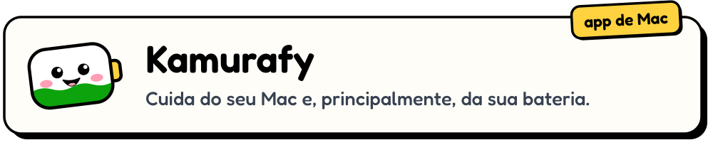
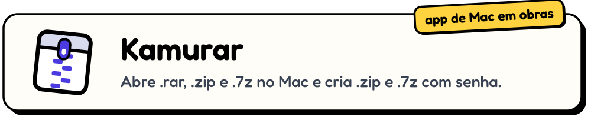
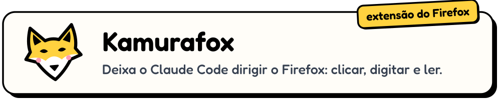
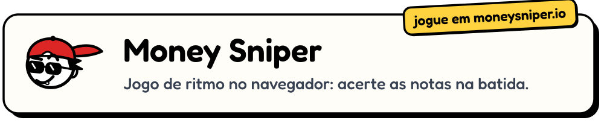

<picture>
  <source media="(prefers-color-scheme: dark)" srcset="img/topo-escuro.svg">
  
</picture>
<a href="https://github.com/GabrielKamura/kamurafy">
  <picture>
    <source media="(prefers-color-scheme: dark)" srcset="img/kamurafy-escuro.svg">
    
  </picture>
</a>
<a href="https://github.com/GabrielKamura/kamurar">
  <picture>
    <source media="(prefers-color-scheme: dark)" srcset="img/kamurar-escuro.svg">
    
  </picture>
</a>
<a href="https://github.com/GabrielKamura/kamurafox">
  <picture>
    <source media="(prefers-color-scheme: dark)" srcset="img/kamurafox-escuro.svg">
    
  </picture>
</a>
<a href="https://moneysniper.io">
  <picture>
    <source media="(prefers-color-scheme: dark)" srcset="img/moneysniper-escuro.svg">
    
  </picture>
</a>
<picture>
  <source media="(prefers-color-scheme: dark)" srcset="https://raw.githubusercontent.com/GabrielKamura/GabrielKamura/vivo/numeros-escuro.svg">
  
</picture>
<picture>
  <source media="(prefers-color-scheme: dark)" srcset="https://raw.githubusercontent.com/GabrielKamura/GabrielKamura/vivo/cobrinha-escuro.svg">
  
</picture>

<a href="https://www.instagram.com/gabriel_kamura"><picture><source media="(prefers-color-scheme: dark)" srcset="img/instagram-escuro.svg"></picture></a>
<a href="https://www.linkedin.com/in/gabrielkamura"><picture><source media="(prefers-color-scheme: dark)" srcset="img/linkedin-escuro.svg"></picture></a>
<a href="https://moneysniper.io"><picture><source media="(prefers-color-scheme: dark)" srcset="img/site-escuro.svg"></picture></a>

Os apps e a extensão são grátis e de código aberto (GPL). O jogo é só abrir e jogar.
