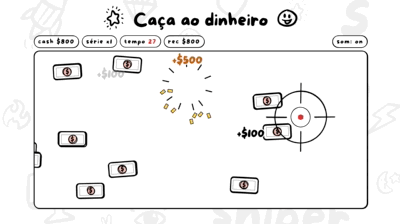

## Hi, I'm Gabriel Kamura! I make Mac apps, extensions and games.

- [Kamurafy](https://github.com/GabrielKamura/kamurafy): takes care of your Mac and, above all, its battery.
- [Kamurar](https://github.com/GabrielKamura/kamurar): opens .rar, .zip and .7z on the Mac and creates password-protected .zip and .7z. Work in progress.
- [Kamurafox](https://github.com/GabrielKamura/kamurafox): lets Claude Code drive Firefox: click, type and read pages.
- [Money Sniper](https://moneysniper.io): a rhythm game you play in the browser.

  

 
  
  
  
  
  
  

##

  
  
  

  

##

<picture>
  <source media="(prefers-color-scheme: dark)" srcset="https://raw.githubusercontent.com/GabrielKamura/GabrielKamura/output/github-contribution-grid-snake-dark.svg">
  
</picture>
